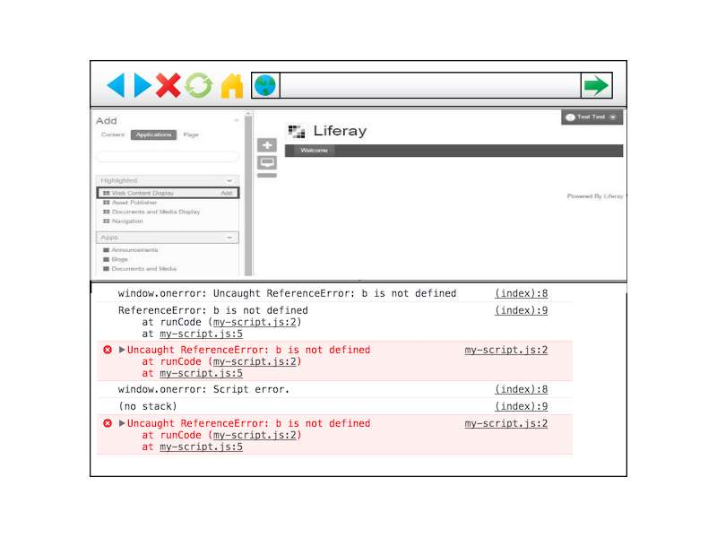
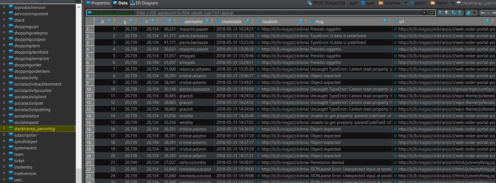

# liferay-stacktrace-js

Liferay plugin to save frontend js errors into backend service

Capture and track your application's frontent js exceptions saving it silently into liferay service.
Automatically collects all uncaught exceptions from your users' browsers, and presents a detailed log of their circumstances. 

## JS error to Table

On browser side an unmanaged JS error happens..

Plugin catch it and save to a specific liferay table...

## TODO:

- Notification system
- Control panel portlet to view js errors logs.
